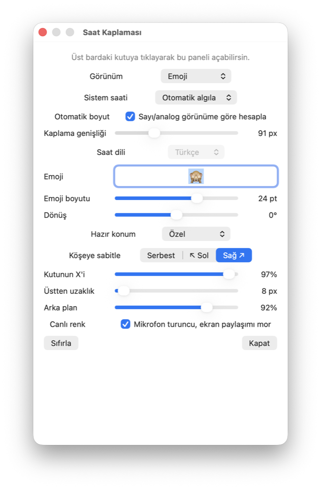

# ClockScrambler

[](https://www.apple.com/macos/)
[](https://www.swift.org/)
[](LICENSE)

ClockScrambler is a lightweight, open-source macOS menu bar utility that covers
the system clock with a customizable emoji, digital time, or natural-language
clock. It follows the live menu bar background, reacts to privacy activity, and
stays readable across wallpapers, Spaces, and full-screen apps.

If ClockScrambler is useful to you, please consider
[starring the repository](https://github.com/benfirad/ClockScrambler). It helps
other Mac users discover the project.

<p align="center">
  
</p>

## Why ClockScrambler?

The macOS clock cannot be freely styled or replaced. ClockScrambler places a
small, non-activating overlay above it, giving you control without modifying
system files.

- Replace the menu bar clock with an emoji
- Show digital time or a written clock
- Use natural clock phrases in Turkish, Spanish, or English
- Automatically detect a digital or analog system clock
- Automatically size the overlay to cover the original clock
- Override the cover width manually from 44 to 200 points
- Pin the overlay flush to the upper-left or upper-right corner
- Adjust text or emoji size, rotation, position, and opacity
- Match the real clock-area background once per second
- Optional low-resource screen-frame mode with a black fill, subtle stroke,
  and rounded bottom-left corner
- Show or hide the screen-frame stroke independently
- Refresh automatically after wallpaper and Space changes
- Turn pure black above a full-screen app
- Use calibrated orange while the microphone is active
- Use calibrated purple while screen sharing or recording is active
- Launch as an accessory app without a Dock icon

## Screenshot



## Privacy

ClockScrambler is designed to work locally:

- No analytics
- No accounts
- No network requests
- No audio recording
- No microphone permission
- No Screen Recording permission

Microphone activity is detected by reading CoreAudio's device-running state;
audio samples are never opened or stored. To match the menu bar, the app reads
only the small clock-sized rectangle directly below its own overlay. That image
is processed in memory to obtain a median background color and is never saved or
transmitted.

## Install

### Download the app

1. Open the repository's
   [Releases](https://github.com/benfirad/ClockScrambler/releases) page.
2. Download `ClockScrambler-1.6-macOS.zip`.
3. Move `ClockScrambler.app` to `/Applications`.
4. Launch it and click the menu bar overlay to open settings.

The downloadable build is ad-hoc signed but not Apple-notarized. On the first
launch, macOS may require Control-clicking the app and choosing **Open**.

### Build from source

Requirements:

- macOS 15 or later
- Xcode with a macOS SDK
- [XcodeGen](https://github.com/yonaskolb/XcodeGen)

```bash
brew install xcodegen
git clone https://github.com/benfirad/ClockScrambler.git
cd ClockScrambler
xcodegen generate
open ClockScrambler.xcodeproj
```

Select the `ClockScrambler` scheme and choose **Product → Build**.

For a command-line release build:

```bash
xcodebuild \
  -project ClockScrambler.xcodeproj \
  -scheme ClockScrambler \
  -configuration Release \
  CODE_SIGNING_ALLOWED=NO \
  build
```

## How background matching works

Every second, ClockScrambler reads the clock-sized composite rectangle directly
under its overlay. It discards translucent pixels and uses the median sRGB
color, which minimizes interference from the original clock glyphs and status
icons. The sample updates when the wallpaper, active Space, appearance, or
visible menu bar changes.

If sampling is unavailable, the app falls back to the standard macOS window
background color.

## Project structure

```text
ClockScrambler/
├── ClockScrambler/
│   ├── AppDelegate.swift
│   ├── Assets.xcassets/
│   ├── Info.plist
│   └── main.swift
├── ClockScrambler.xcodeproj/
├── docs/
├── project.yml
├── LICENSE
└── README.md
```

## Contributing

Bug reports and pull requests are welcome. Please include your macOS version,
display configuration, clock style, and a cropped menu bar screenshot when
reporting visual matching issues.

## License

ClockScrambler is available under the [MIT License](LICENSE).
